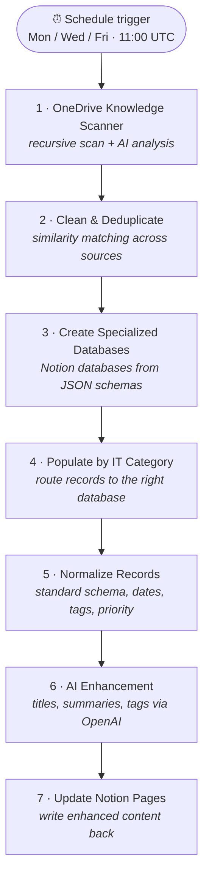

# Database Buddy

**Automated IT knowledge-base builder.** On a schedule, Database Buddy scans OneDrive for IT documentation, analyzes and classifies every document with OpenAI, then builds and populates specialized Notion databases — cleaned, deduplicated, normalized, and AI-enriched.

Built as a [Pipedream](https://pipedream.com) workflow with **seven custom Node.js steps** (all step code is in [`steps/`](steps/)).

> **Try it:** deploy a copy of this workflow into your own Pipedream workspace → [pipedream.com/new?h=tch_BXf12z](https://pipedream.com/new?h=tch_BXf12z)

## How it works



The result is a self-organizing knowledge base: drop documents into OneDrive, and three mornings a week they are classified into ten IT category databases in Notion — **Network Infrastructure, VDI, Applications, Hardware, Security, MDM, Cloud Services, Backup Recovery, User Management, and Monitoring** — each page carrying an AI-generated title, summary, tags, and priority.

## The pipeline, step by step

### 1 · Comprehensive OneDrive Knowledge Scanner
[`steps/01_comprehensive_onedrive_processor.js`](steps/01_comprehensive_onedrive_processor.js)

- Recursively walks a OneDrive folder tree through the Microsoft Graph API (`/items/{id}/children`), with a configurable exclude list (`temp`, `cache`, `backup`, …) and file cap.
- Filters by MIME type: Word, PDF, plain text, Markdown, OneNote.
- Extracts content per type — plain text and Markdown are downloaded and read in full; binary formats (PDF/Word/OneNote) are captured as structured metadata descriptors. (Full binary text extraction is a documented limitation, not an overclaim — see [Design notes](#design-notes).)
- Sends each document to **GPT-4o** with a structured prompt that returns strict JSON: document type, key topics, technical relevance, key information, use cases, knowledge category, and a confidence score.
- Deduplicates by Jaccard word-set similarity with a configurable threshold, keeping the better-extracted copy of each near-duplicate pair.
- Emits one of three output shapes (`json`, `summary`, `knowledge_base`) plus per-run performance metrics.

### 2 · Clean & Deduplicate
[`steps/02_clean_and_deduplicate_data.js`](steps/02_clean_and_deduplicate_data.js)

Merges records from up to three sources (OneDrive scan, Excel exports, OneNote content), normalizes the text, and removes duplicates by percentage similarity. Processes in configurable batches, and can persist its dedup state in a Pipedream Data Store so reruns don't re-process or re-admit duplicates across executions.

### 3 · Create Specialized IT Databases
[`steps/03_create_specialized_it_databases.js`](steps/03_create_specialized_it_databases.js)

Creates Notion databases at the **workspace level** (sidestepping archived-ancestor failures), with properties defined as JSON — supporting title, select, multi-select, number, date, people, files, checkbox, URL, email, phone, relation, and rollup types.

### 4 · Populate by IT Category
[`steps/04_populate_specialized_databases.js`](steps/04_populate_specialized_databases.js)

Routes each record to the right database using a category normalizer that maps 25+ aliases onto the ten canonical IT categories (`"azure"` → Cloud Services, `"identity"` → User Management, `"virtual desktop"` → VDI, …). Builds full Notion page properties (name, source, category, content type, tags, dates, summary) and body blocks, and reports created pages and per-category counts.

### 5 · Normalize Records
[`steps/05_normalize_database_records.js`](steps/05_normalize_database_records.js)

Coerces messy records into one standard schema. Field names are resolved case-insensitively against configurable candidate lists (`title`/`name`/`subject`/…), dates are normalized to ISO-8601 (handling both second and millisecond timestamps), tags are split on five delimiters, and status/priority values are mapped to canonical vocabularies (`"done"` → `completed`, `"blocker"` → `critical`). Unrecognized fields are preserved under `metadata` rather than dropped.

### 6 · AI Enhancement
[`steps/06_enhance_individual_records.js`](steps/06_enhance_individual_records.js)

Each record gets a second OpenAI pass (model configurable, default `gpt-3.5-turbo`) producing an enhanced title, detailed summary, categories, suggested tags, priority level, and content type — with optional caller-defined custom sections (e.g. `action_items`, `risk_assessment`). If the model returns malformed JSON, a fallback enhancement is constructed so the pipeline never stalls on one bad record.

### 7 · Update Notion Pages
[`steps/07_update_notion_pages_with_enhanced_content.js`](steps/07_update_notion_pages_with_enhanced_content.js)

Matches enhanced records back to the pages created in step 4 (by page ID, title, or original ID), updates titles/summary/tags, and writes formatted content blocks — either appending or fully replacing existing content. Optionally re-parents pages under a designated parent and archives pages that no longer have a matching record.

## Design notes

- **No secrets in code.** All authentication goes through Pipedream's managed app connections (`microsoft_onedrive`, `openai`, `notion`); database targets are configurable props. Nothing in this repo is credential-bearing.
- **Fail-soft everywhere.** Every step accumulates per-item errors into result arrays instead of throwing, so one bad document never kills a run; AI steps carry JSON-parse fallbacks.
- **Tunable via ~40 exposed props** — similarity thresholds, batch sizes, file caps, output formats, custom AI sections — without touching code.
- **Known limitation:** PDF/Word/OneNote content is analyzed from metadata descriptors, not full binary text extraction. Wiring in a document-parsing service (e.g. Azure Document Intelligence) is the natural next step.

## Deploy your own

1. Open the share link: **[pipedream.com/new?h=tch_BXf12z](https://pipedream.com/new?h=tch_BXf12z)**
2. Connect your **Microsoft OneDrive**, **OpenAI**, and **Notion** accounts when prompted.
3. Point the scanner at a OneDrive folder and select file types to include.
4. Create (or map) the Notion databases for the categories you want, and set the schedule (this deployment runs `0 11 * * 1,3,5` UTC).

## Repo layout

```
steps/    Exact source of each workflow step, exported from Pipedream
```

## License

Copyright (c) 2026 Isaiah Anson. All rights reserved. You may use the released software for
personal, non-commercial use; copying, modifying or redistributing it requires written
permission. See [LICENSE](LICENSE).

