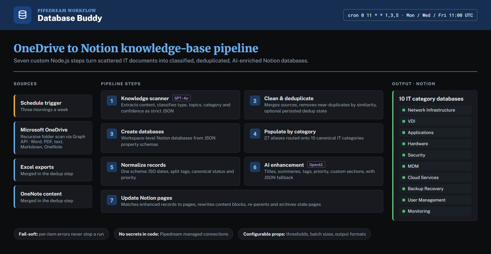
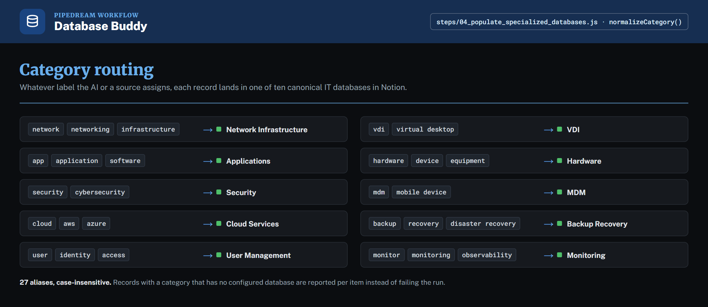

# Database Buddy

[](https://github.com/IsaiahAnson/database-buddy/actions/workflows/ci.yml)

An automated IT knowledge-base builder. On a schedule, it scans OneDrive for IT documentation,
classifies every document with OpenAI, and builds cleaned, deduplicated, AI-enriched Notion
databases, one per IT category.

Built as a [Pipedream](https://pipedream.com) workflow with seven custom Node.js steps. All step
code is in [`steps/`](steps/).



## Category routing



Whatever label the AI or a source assigns, each record lands in one of ten Notion databases.
Records whose category has no configured database are reported per item instead of failing the run.

## Features

- **Scheduled scanning**: recursively walks a OneDrive folder tree through the Microsoft Graph
  API on Monday, Wednesday and Friday at 11:00 UTC, with an exclude list and a file cap.
- **AI classification**: GPT-4o returns strict JSON for each document (type, key topics,
  technical relevance, use cases, category and a confidence score).
- **Deduplication**: merges OneDrive, Excel and OneNote records and removes near-duplicates by
  similarity, keeping the better-extracted copy. Dedup state can persist across runs in a
  Pipedream Data Store.
- **Category routing**: 27 aliases (`azure`, `identity`, `virtual desktop`, …) map onto ten
  databases: Network Infrastructure, VDI, Applications, Hardware, Security, MDM, Cloud Services,
  Backup Recovery, User Management and Monitoring.
- **Normalization**: one standard schema with ISO-8601 dates, tags split on five delimiters, and
  canonical status and priority values. Unrecognized fields are kept under `metadata`.
- **AI enhancement**: a second OpenAI pass writes titles, summaries, tags, priority and optional
  custom sections such as `action_items`, with a fallback when the model returns bad JSON.
- **Notion sync**: matches enhanced records back to their pages, rewrites content blocks, and can
  re-parent pages and archive ones that no longer have a matching record.

## Stack

- [Pipedream](https://pipedream.com) workflow (Node.js, ES modules)
- Microsoft Graph API for OneDrive
- OpenAI (GPT-4o for scanning, `gpt-3.5-turbo` by default for enhancement)
- Notion API
- GitHub Actions syntax check for every step

## Quickstart

1. Open the share link: **[pipedream.com/new?h=tch_BXf12z](https://pipedream.com/new?h=tch_BXf12z)**
2. Connect your **Microsoft OneDrive**, **OpenAI** and **Notion** accounts when prompted.
3. Point the scanner at a OneDrive folder and pick the file types to include.
4. Create or map the Notion databases for the categories you want, and set the schedule. This
   deployment runs `0 11 * * 1,3,5` (UTC).

## How it works

### 1 · OneDrive knowledge scanner
[`steps/01_comprehensive_onedrive_processor.js`](steps/01_comprehensive_onedrive_processor.js)

Walks the folder tree (`/items/{id}/children`), filters by MIME type (Word, PDF, plain text,
Markdown, OneNote) and extracts content. Plain text and Markdown are read in full; binary formats
are captured as structured metadata descriptors. Each document goes to GPT-4o for classification,
near-duplicates are dropped by Jaccard word-set similarity, and the step emits one of three output
shapes (`json`, `summary`, `knowledge_base`) with per-run metrics.

### 2 · Clean and deduplicate
[`steps/02_clean_and_deduplicate_data.js`](steps/02_clean_and_deduplicate_data.js)

Merges records from up to three sources (OneDrive scan, Excel exports, OneNote content),
normalizes text, and removes duplicates by percentage similarity in configurable batches.

### 3 · Create specialized IT databases
[`steps/03_create_specialized_it_databases.js`](steps/03_create_specialized_it_databases.js)

Creates Notion databases at the workspace level, which avoids failures from archived parent
pages. Properties are defined as JSON and support title, select, multi-select, number, date,
people, files, checkbox, URL, email, phone, relation and rollup types.

### 4 · Populate by IT category
[`steps/04_populate_specialized_databases.js`](steps/04_populate_specialized_databases.js)

Routes each record to its database through the category map, builds full page properties and
body blocks, and reports created pages and per-category counts.

### 5 · Normalize records
[`steps/05_normalize_database_records.js`](steps/05_normalize_database_records.js)

Resolves field names case-insensitively against candidate lists (`title`/`name`/`subject`/…),
normalizes second and millisecond timestamps to ISO-8601, and maps status and priority values to
canonical vocabularies (`"done"` → `completed`, `"blocker"` → `critical`).

### 6 · AI enhancement
[`steps/06_enhance_individual_records.js`](steps/06_enhance_individual_records.js)

Produces an enhanced title, detailed summary, categories, suggested tags, priority and content
type per record, plus any caller-defined custom sections.

### 7 · Update Notion pages
[`steps/07_update_notion_pages_with_enhanced_content.js`](steps/07_update_notion_pages_with_enhanced_content.js)

Matches records to pages by page ID, title or original ID, updates properties, and appends or
replaces formatted content blocks.

## Design notes

- **No secrets in code.** Authentication goes through Pipedream's managed app connections
  (`microsoft_onedrive`, `openai`, `notion`). Nothing in this repo holds credentials.
- **Fail-soft.** Every step collects per-item errors instead of throwing, so one bad document
  never stops a run.
- **Configurable.** Similarity thresholds, batch sizes, file caps, output formats and custom AI
  sections are exposed as step props.
- **Known limitation:** PDF, Word and OneNote content is analyzed from metadata descriptors, not
  full binary text extraction. A document-parsing service such as Azure Document Intelligence is
  the natural next step.

## Project layout

```text
steps/          source of each workflow step, exported from Pipedream
docs/images/    README diagrams
.github/        CI (syntax check for every step)
```

## License

Copyright (c) 2026 Isaiah Anson. All rights reserved. You may use the released software for
personal, non-commercial use; copying, modifying or redistributing it requires written
permission. See [LICENSE](LICENSE).
